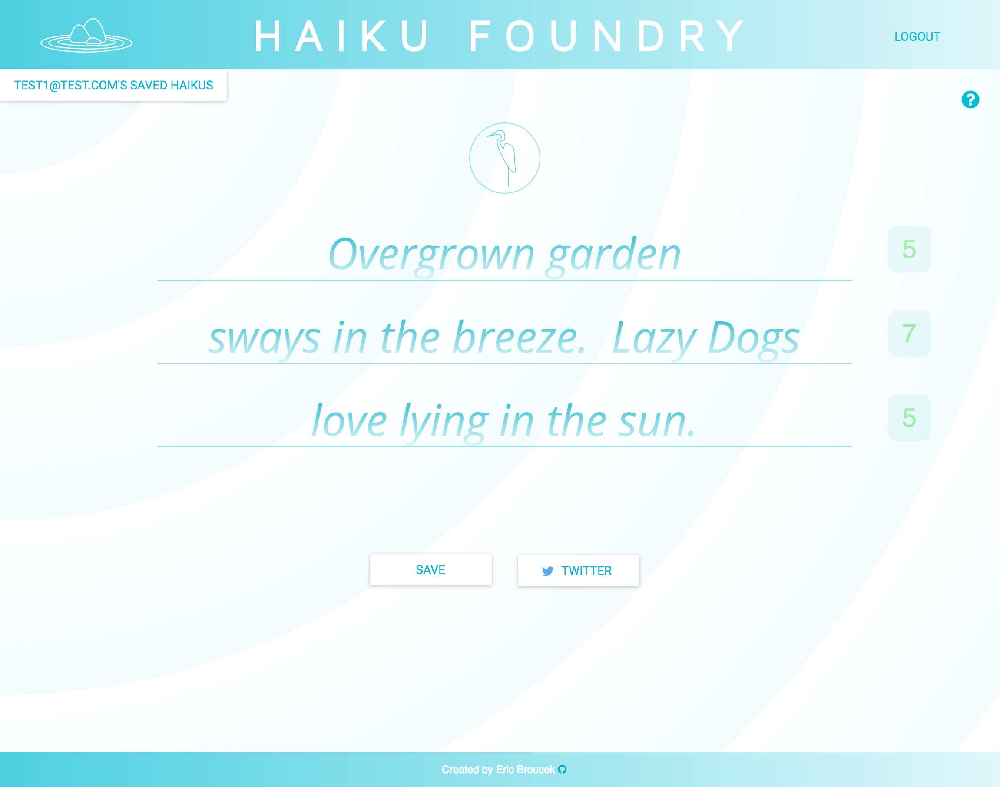
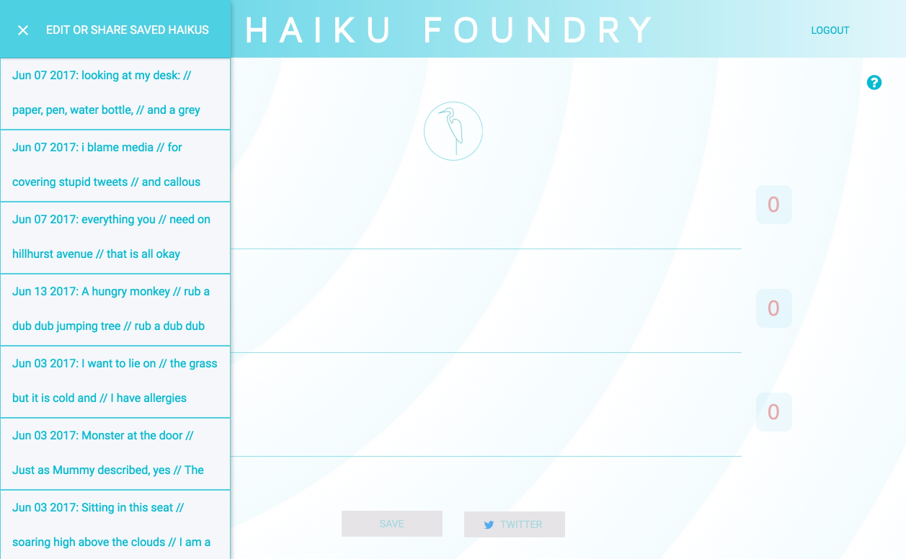

HAIKU FOUNDRY 
===========

Haiku Foundry is an app for creating and sharing your own haikus.  Everyone from kids to adults can enjoy the fun of poetic expression within this traditional three-lined format from Japan!

* Create an account or use the demo login button to take a look around
* Compose original haikus and save them
* Syllable counters give you instantaneous visual feedback on your formatting
* Share your creations via Twitter
* Go back and edit your saved haikus or share them later

Live Site
---------
* Haiku Foundry is live at [https://haiku-foundry.herokuapp.com/](https://haiku-foundry.herokuapp.com/)      

Screen Shots
------------   
**Landing Page:**

**Login Page:**

**Editing on the Home Page:**

**Saved Haiku Drawer Open on the Home Page:**

Technical
---------
Haiku Foundry features a mobile-first design and utilizes the following technologies:

* HTML5, CSS, Javascript, Node JS, Express, MongoDB, Mongoose, React, Redux, Firebase
* Unit testing & continuous integration with Chai, Enzyme, & Travis CI

Author
------
* **[Eric Broucek](https://github.com/ebrou)**
